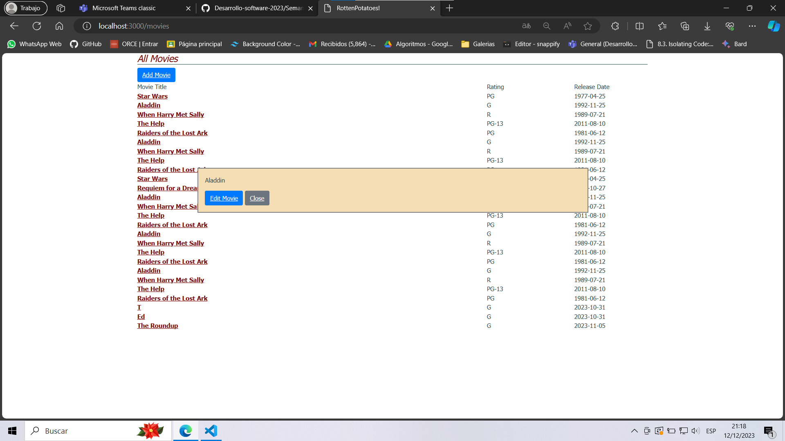

# Parte 1

Modificamos la acción show de forma que, si está respondiendo a una petición AJAX, procesará la sencilla vista parcial el código siguiente en lugar de la vista completa.

```Ruby
def show
    id = params[:id] # retrieve movie ID from URI route
    @movie = Movie.find(id) # look up movie by unique ID
    render(:partial => 'movie', object => @movie) if request.xhr?
end
```

Así como tambien modificamos la vista parcial a mostrarse en nuestra carpeta views

```html
 <p> <%= movie.description %> </p>
 <%= link_to 'Edit Movie', edit_movie_path(movie), :class => 'btn btn-primary' %>
 <%= link_to 'Close', '', :id => 'closeLink', :class => 'btn btn-secondary' %>
```

## Pregunta

¿Cómo sabe la acción de controlador si show fue llamada desde código JavaScript o mediante una petición HTTP normal iniciada por el usuario?

## Respuesta

Usando métodos y encabezados de solicitud ya que en estos mismos podemos visualizar y acceder a los atributos para diferenciar entre solicitudes Javascript y solucitudes http (iniciadas por el usuario)

# Parte 2

Como queremos mostrar el partial movie cada que pinchemos una pelicula debemos usar codigo js ya que este mismo facilita a manipular el DOM

```Js
//= require jquery
//= require rails-ujs

var MoviePopup = {
  setup: function() {
    // add hidden 'div' to end of page to display popup:
    let popupDiv = $('<div id="movieInfo"></div>');
    popupDiv.hide().appendTo($('body'));
    $(document).on('click', '#movies a', MoviePopup.getMovieInfo);
  }
  ,getMovieInfo: function() {
    $.ajax({type: 'GET',
            url: $(this).attr('href'),
            timeout: 5000,
            success: MoviePopup.showMovieInfo,
            error: function(xhrObj, textStatus, exception) { alert('Error!'); }
            // 'success' and 'error' functions will be passed 3 args
           });
    return(false);
  }
  ,showMovieInfo: function(data, requestStatus, xhrObject) {
    // center a floater 1/2 as wide and 1/4 as tall as screen
    let oneFourth = Math.ceil($(window).width() / 4);
    $('#movieInfo').
      css({'left': oneFourth,  'width': 2*oneFourth, 'top': 250}).
      html(data).
      show();
    // make the Close link in the hidden element work
    $('#closeLink').click(MoviePopup.hideMovieInfo);
    return(false);  // prevent default link action
  }
  ,hideMovieInfo: function() {
    $('#movieInfo').hide();
    return(false);
  }
};
$(MoviePopup.setup);
```

Todo este código lo añadimos en un archivo js dentro de de app/assets/javascripts/

- setup

Genera un elemento div al final de la página para mostrar la información de la película mediante un evento click.

- getMovieInfo

Realiza una solicitud Ajax usando el enlace del elemento seleccionado luego establece codigo para que en caso sea satisfactoria la peticion muestre el modal

- showMovieInfo

Muestra la pelicula en el modal utilizando css para calcular la posición y el tamaño de la ventana emergente basándose en el tamaño de la pantalla. Agrega la funcionalidad del hideMovieInfo (cerrar el modal)

- hideMovieInfo

Oculta el elemento del DOM con id #movieInfo, es decir el modal que surge cuando hacemos click a una pelicula

Ahora para poder ver los resultados modificamos el index.html.erb para que utilice el código js que implementamos previamente

```html
<h1>All Movies</h1>

<%= link_to 'Add Movie', new_movie_path, :class => 'btn btn-primary' %>
<%= stylesheet_link_tag 'application' %>
<div id="movies">
  <div class="row">
    <div class="col-8">Movie Title</div>
    <div class="col-2">Rating</div>
    <div class="col-2">Release Date</div>
  </div>
  <%- @movies.each do |movie| %>
    <div class="row">
      <div class="col-8"> <%= link_to movie.title, movie_path(movie) %> </div>
      <div class="col-2"> <%= movie.rating %></div>
      <div class="col-2"> <%= movie.release_date.strftime('%F') %> </div>
    </div>
  <% end %>
</div>

<%= javascript_include_tag 'show_movie_partial' %>

```

`<%= javascript_include_tag 'show_movie_partial' %>` Es el encargado de importar el código js

Y tenemos como resultado



# Parte 3

## Pregunta

Conviene mencionar una advertencia a considerar cuando se usa JavaScript para crear nuevos elementos dinámicamente en tiempo de ejecución, aunque no surgió en este ejemplo en concreto. Sabemos que $(.myClass).on(click,func) registra func como el manejador de eventos de clic para todos los elementos actuales que coincidan con la clase CSS myClass. Pero si se utiliza JavaScript para crear nuevos elementos que coincidan con myClass después de la carga inicial de la página y de la llamada inicial a on, dichos elementos no tendrán el manejador asociado, ya que on sólo puede asociar manejadores a elementos existentes.

¿Cuál es solución que brinda jQuery a este problema?

## Respuesta

La solución que brinda jQuery a este problema es el método .delegate(). Este método, a diferencia de .on(), permite asociar manejadores de eventos a elementos que aún no existen. 

Para ello, .delegate() utiliza un selector CSS para buscar los elementos a los que se desea asociar el manejador. Cuando se crea un nuevo elemento que coincide con el selector CSS, jQuery asociará el manejador al nuevo elemento.
Un ejemplo básico sería

```Js
$(document).delegate(".myClass", "click", function() {
  // Código del manejador de eventos
});
```