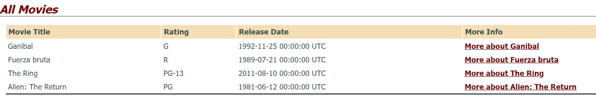
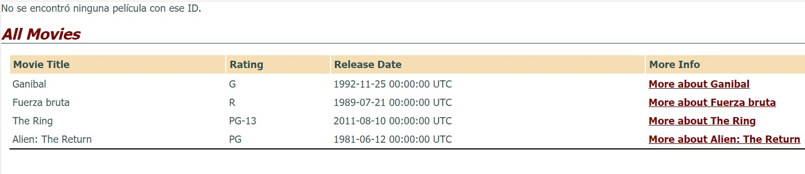

# Parte 1
1. Escribe una función que acepte una cadena que contenga todas las letras del alfabeto excepto una y devuelva la letra que falta
```Ruby
def findLetter(frase)
  frecuencia_letras = Hash.new(0)

  frase.downcase.each_char do |letra|
    frecuencia_letras[letra] += 1
  end
  
  ('a'..'z').each do |letra|
    return letra unless frecuencia_letras[letra] > 0
  end
end

frase = "the quick brown box jumps over a lazy dog"
letra_faltante = findLetter(frase)
puts "La letra que falta es: #{letra_faltante}"
```

La función primero itera sobre cada letra de la frase, la cual tiene una longitud "n" entonces este algoritmo tiene una complejidad O(n)
```Ruby
  frase.downcase.each_char do |letra|
    frecuencia_letras[letra] += 1
  end
```

Después itera sobre todas las letras del abecedario es decir 26 veces, como es una constante la complejidad es O(1)

```Ruby
  ('a'..'z').each do |letra|
    return letra unless frecuencia_letras[letra] > 0
  end
```

Por ende, la complejidad total de la función es O(n)

2. Defina una clase colección llamada BinaryTree que ofrezca los métodos de instancia << (insertar elemento), empty? (devuelve cierto si el árbol no tiene elementos) y each (el iterador que devuelve un elemento cada vez, en el orden que tú quieras).

```Ruby
class BinaryTree
  attr_accessor :value, :left, :right
  
  def initialize(value)
    @value = value
    @left = nil
    @right = nil
  end

  def <<(element)
    if element <= @value
      if @left.nil?
        @left = BinaryTree.new(element)
      else
        @left << element
      end
    else
      if @right.nil?
        @right = BinaryTree.new(element)
      else
        @right << element
      end
    end
  end

  def empty?
    @left.nil? && @right.nil?
  end

  def each(&block)
    @left.each(&block) unless @left.nil?
    yield @value
    @right.each(&block) unless @right.nil?
  end
end
```
El método `<<` se utiliza para insertar un elemento en el árbol, la primera línea dentro del método compara el element con el valor del nodo actual `@value`. Si element es menor o igual que ``@value``, el método intentará insertar el elemento en el subárbol izquierdo. Si element es mayor que `@value`, se intentará insertar en el subárbol derecho.

El método empty? verifica si el árbol está vacío o no.

El método each permite recorrer los elementos del árbol en el orden deseado (en este caso, en orden ascendente).

3. Extiende la clase de tu árbol binario ordenado para que ofrezca los siguientes métodos, cada uno de los cuales toma un bloque: include?(elt) (devuelve cierto si el árbol incluye a elt), all? (cierto si un bloque dado es cierto para todos los elementos), any? (cierto si un bloque dado es cierto para alguno de sus elementos), sort (ordena los elementos)

```Ruby
class BinaryTree
  attr_accessor :value, :left, :right
  
  def initialize(value)
    @value = value
    @left = nil
    @right = nil
  end

  def <<(element)
    if element <= @value
      if @left.nil?
        @left = BinaryTree.new(element)
      else
        @left << element
      end
    else
      if @right.nil?
        @right = BinaryTree.new(element)
      else
        @right << element
      end
    end
  end

  def empty?
    @left.nil? && @right.nil?
  end

  def each(&block)
    @left.each(&block) unless @left.nil?
    yield @value
    @right.each(&block) unless @right.nil?
  end

  def include?(elt, &block)
    return true if @value == elt
    
    if elt < @value && @left
      @left.include?(elt, &block)
    elsif elt > @value && @right
      @right.include?(elt, &block)
    else
      false
    end
  end

  def all?(&block)
    return false unless block.call(@value)
    @left.all?(&block) && @right.all?(&block)
  end

  def any?(&block)
    return true if block.call(@value)
    @left.any?(&block) || @right.any?(&block)
  end

  def sort
    result = []
    result += @left.sort if @left
    result << @value
    result += @right.sort if @right
    result
  end
end
```

- Include: Verifica si un elemento elt está presente en el árbol. Busca en el subárbol izquierdo si elt es menor que el valor actual, en el subárbol derecho si elt es mayor, y devuelve true si encuentra el elemento. Si el elemento no se encuentra en el árbol, devuelve false.
- All: Si un bloque devuelve true para todos los elementos del árbol. Utiliza la recursión para aplicar el bloque a cada nodo y a sus subárboles izquierdo y derecho. Devuelve true si el bloque es verdadero para todos los nodos y false en caso contrario.
- Any: Este método verifica si un bloque devuelve true para al menos uno de los elementos del árbol. Utiliza la recursión para aplicar el bloque a cada nodo y a sus subárboles izquierdo y derecho. Devuelve true si el bloque es verdadero para al menos un nodo y en caso no lo sea devuelve false.
-Sort: Devuelve una lista ordenada ascendentemente con todos los elementos del arbol separandolos por subarbol derecho e izquierdo.
***
# Parte 2

## Introducción a Rails
1. Redirigimos a la acción show de la pelicula recién creada usando el id de la película

```Ruby
def show
  id = params[:id]
  @movie = Movie.find(id)
end
```

2. Hacemos el campo descripción visible y editable en las vistas New y Edit

```Ruby
class Movie < ActiveRecord::Base
  private
  def movie_params
    params.require(:movie).permit(:title, :rating, :description, :release_date)
  end
end
```

3. Modificamos el método show para capturar el error al momento de pasar una película que no existe (/movies/99)

```Ruby
  def show
    id = params[:id]
    begin
      @movie = Movie.find(id)
    rescue ActiveRecord::RecordNotFound
      flash[:notice] = "No se encontró ninguna película con ese ID."
      redirect_to movies_path
    end
  end
```

De igual manera modificamos la vista index.html.haml para mostrar el mensaje al usuario

```haml
-#  This file is app/views/movies/index.html.haml
- if flash[:notice].present?
  .alert.alert-info
    = flash[:notice]
    
%h1 All Movies

%table#movies
  %thead
    %tr
      %th Movie Title
      %th Rating
      %th Release Date
      %th More Info
  %tbody
    - @movies.each do |movie|
      %tr
        %td= movie.title
        %td= movie.rating
        %td= movie.release_date
        %td= link_to "More about #{movie.title}", movie_path(movie)
```
***
# Parte 3
## Crear y aplicar migración
Basándonos en la documentación de [Active Record Migrations](https://guides.rubyonrails.org/active_record_migrations.html)

- Ejecutamos el comando
```shell
rails generate migration CreateMovies
```
- Esto nos crea un archivo llamado `20231011152113_create_movies.rb` en la ruta db/migrate que contiene lo siguiente:
```Ruby
class CreateMovies < ActiveRecord::Migration[7.0]
  def change
    create_table :movies do |t|
      t.string 'title'  
      t.string 'rating'
      t.text 'description'
      t.datetime 'release_date' # Add fields that let Rails automatically keep track # of when movies are added or modified:
      t.timestamps
    end
  end
end
```
- Una vez completado esto realizamos la migración para crear el esquema de nuestra base de datos
```shell
rails db:migrate
```

## Crear modelo inicial e inicializar base de datos
- Creamos el archivo `movie.rb` en la ruta app/models con el siguiente contenido para definir a `Movie` como modelo

```Ruby
class Movie < ActiveRecord::Base

end
```

- Una vez hecho esto agregamos datos iniciales a la base de datos (db/seeds.rb)

```Ruby
more_movies = [
    {:title => 'Ganibal', :rating => 'G',
    :release_date => '25-Nov-1992'},
    {:title => 'Fuerza bruta', :rating => 'R',
    :release_date => '21-Jul-1989'},
    {:title => 'The Ring', :rating => 'PG-13',
    :release_date => '10-Aug-2011'},
    {:title => 'Alien: The Return ', :rating => 'PG',
    :release_date => '12-Jun-1981'}   
]
    
more_movies.each do |movie| Movie.create!(movie) end
```
## Crear rutas, acciones y vistas CRUD para películas
- Agregamos el siguiente código en `routes.rb` para que al momento de inicializar la aplicación nos envie a la ruta /movies en vez de la página de inicio
```Ruby
  Myrottenpotatoes::Application.routes.draw do
    resources :movies
    root :to => redirect('/movies')
  end
```

- Para crear tanto el archivo del controlador como las vistas asociadas, ejecutamos el siguiente comando:

```Shell
rails generate scaffold_controller Movie title rating description release_date --skip-test
```

- Con esto ya tenemos la aplicación funcionando



- Cuando tratamos de acceder a rutas como /movies/999



